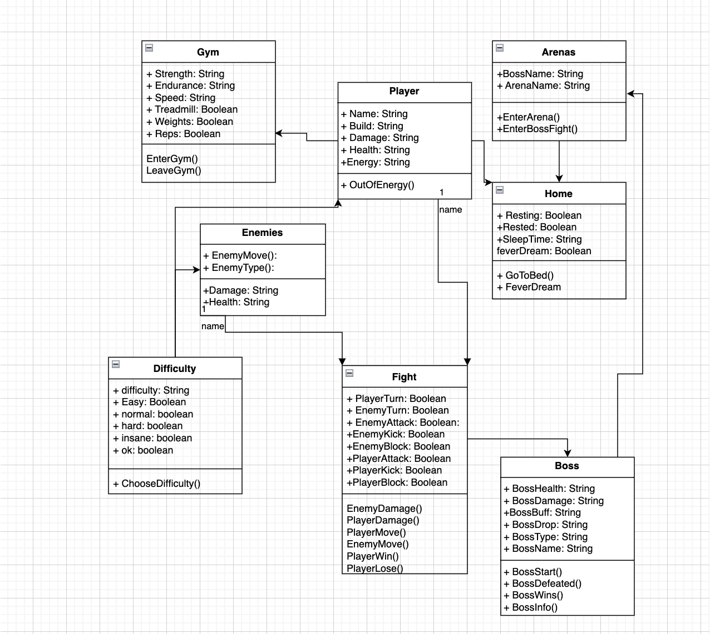
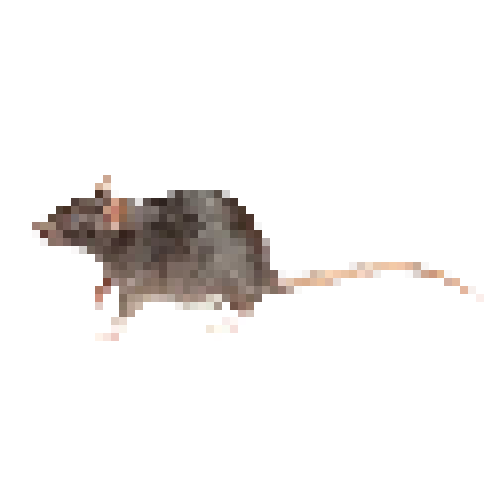
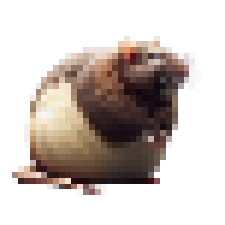

# RATS
### a game by grayson carter

# What the game is:

### I aim to make this game very similar to pokemon, but instead of your average pokemon world, you are actually in new york
#### Fighting rats with mutations

# Stuff currently in the game
## Opening choices that determine name, game difficulty, and what player build you want(player build doesn't do anything right now)
## Gym system to improve stats.

# Stuff I am going to add
## Turn based combat for fighting rats as well as special arenas for each rat type.
## A way to randomize the rats you fight.
## An energy system to limit how much you do per (ingame) day.
## A store to buy equipment with money you get from defeating rats

# Class Diagram

# basic rat(they get cooler i swear)

# what you look like(ingame)

# this is what most bosses are going to look like

